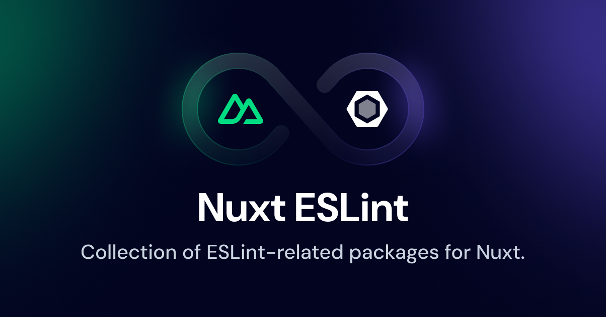

# Nuxt ESLint

  

Collection of [ESLint](https://eslint.org)-related packages for Nuxt ✨

## Packages

- [@nuxt/eslint-config](./packages/eslint-config) - ESLint Config for Nuxt 3

## License

[MIT License](./LICENSE)
